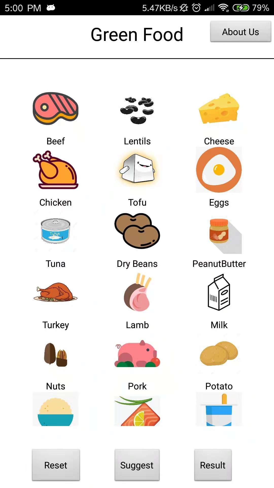
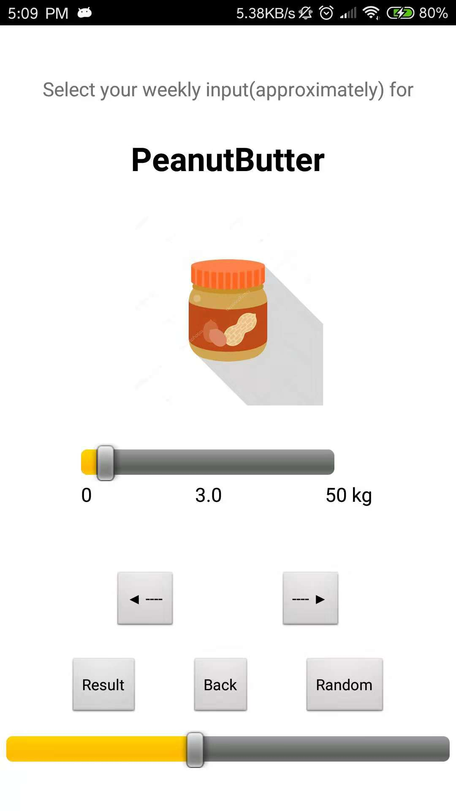
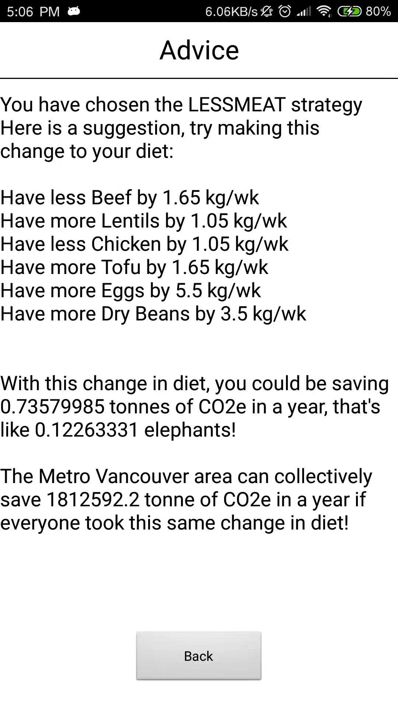

# Green Food Challenge

This app is one of the many Green Food Challenge applications created for CMPT 276 Fall 2018.
Brought to you by the following development team:
-Jack Zhou (Scrum Master)
-Weijie Sun (Product Owner)
-Hewei Cao (Team Member)
-Yijin Ma (Team Member)
-Min-jun Lee (Repo Manager)

## What does this app do?

This app aims to help residents of Metro Vancouver collectively reduce green house gas emissions by changing their diet.
Many necessities for living nowadays produce greenhouse gases, 
a significant type of which are classified as Carbon Dioxide eqivalents (CO2e).

## Why make this app?

-Food is generally under-reported as a source of CO2e. For instance in Europe, agriculture contributes to 10% of the total carbon footprint. 
-In particular, some animals produce methane and therefore more CO2e than other animals.
-In this app, people will learn how much their diet produces in terms of CO2e, and discover how much CO2e they could save by exploring new options.

## Platform

The Current app is built for android devices, we currently support:
- Android devices with API level `21` and `28`
- Screen resolution of `1080x1920` pixels

## Development timeline
This app will be developed in 3 phases:
1. Green Food Challenge Carbon Calculator
2. Green Food Challenge Group Pledge
3. Green Food Challenge Restaurant Guide

## Sample screenshots

- Main screen

- Entering diet habit values

- Receiving suggestions
